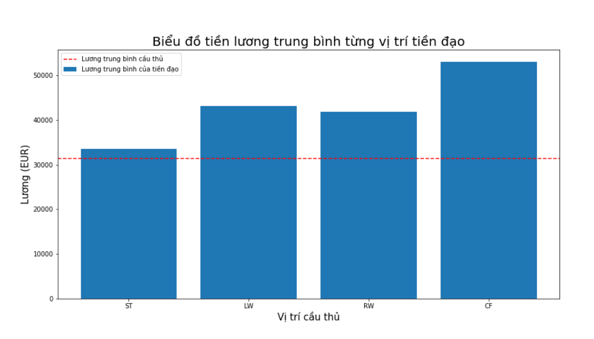
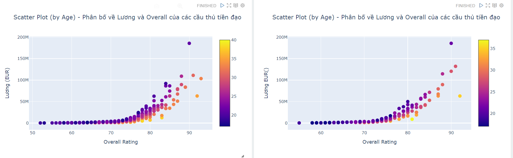
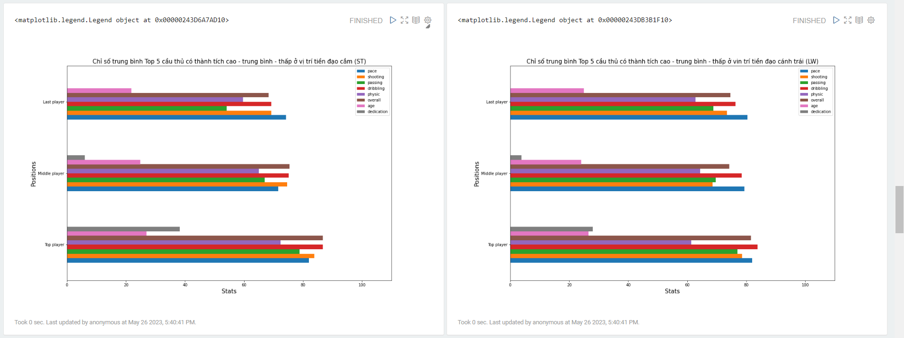
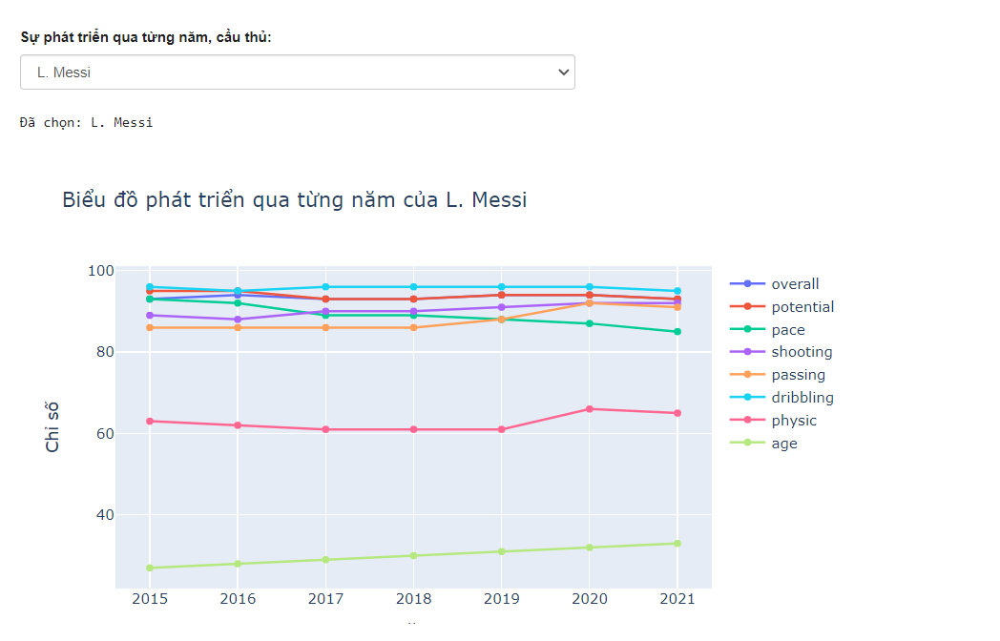
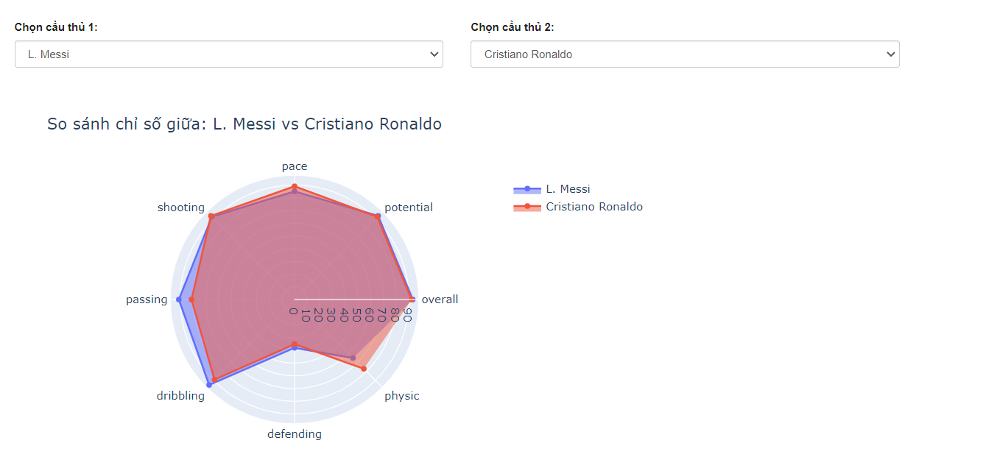

Phân tích dữ liệu cầu thủ bóng đá ở vị trí tiền đạo nhằm giúp nhà quản lý bóng đá, các HLV đưa ra quyết định tốt nhất hơn về việc mua cầu thủ ở vị trí tấn công.

Tập dữ liệu sử dụng:
- Chỉ số cầu thủ: https://www.kaggle.com/datasets/stefanoleone992/fifa-22-complete-player-dataset
- Thành tích cầu thủ: https://www.kaggle.com/datasets/vivovinco/20212022-football-player-stats

Công cụ sử dụng: Apache Zeppelin

1 vài hình ảnh từ dashboard:

